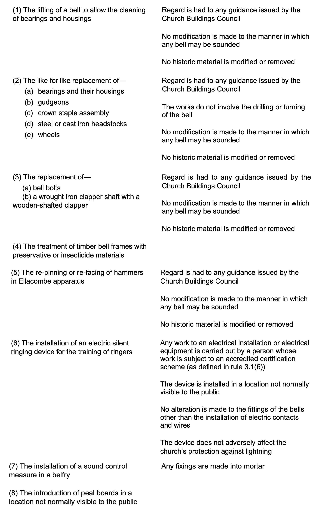

# Faculty Jurisdiction Rules


This chapter refers to activities carried out in churches within the jurisdiction of the Church of England. Ringers must remember that the Rules are set out in law, with possible penalties if they are not followed. Meeting the Rules is the responsibility of the Churchwardens and the Parochial Church Council, and ringers must use their specialist knowledge to assist the Church authorities in any application. Guidance should be sought from the Diocesan Secretary, The Diocesan Bell Advisor, and the local Guild or Association. 


Ringers are probably aware that a Faculty may be required prior to work being done in a Church of England Church. The faculty process exempts churches from listed building consent and conservation area consent that could apply elsewhere. When alterations are proposed, the parish must present the proposals to the archdeacon. For minor alterations, the archdeacon may authorise the work but more major projects will be judged by the Chancellor of the diocese, taking advice from specialists in the [***Diocesan Advisory Committee***](../170-glossary/#diocesan-advisory-committee-dac). The faculty is the legal authorisation of the work by the Chancellor.  

The faculty system is a judicial system, so these notes reflect this style. Parishes and ringers intending do any work in their tower or on their bells must consider the full implications of the Rules.

## Background 

The Faculty Jurisdiction Rules 2015 were introduced with the intention of simplifying the faculty process and reducing the burden of administration, in particular for churchwardens and others in parishes with responsibility for church buildings. The major innovation of the 2015 Rules was the introduction of Lists A and B for items that could be undertaken without a faculty, subject to some general conditions stipulated in the Schedule. 
-	Items in List A may be undertaken by a parish without a faculty and without the need for any form of consultation. 
-	Items in List B may be undertaken without a faculty provided the archdeacon is consulted and has given written authorisation.

The Rules were amended in 2019 and again in 2022. The full version of the latest guidance is [here](https://www.legislation.gov.uk/uksi/2019/1184/article/20/made).

## Items Most Likely to be of Relevance for Ringers

The extracts given below are from Scedule 1 of the (very long) document referenced above and are relevant to bells and associated fittings, and also to clocks. Church clocks are included here because they are typically housed in the church tower and in many cases use the ringing bells as clock bells.


Please note that, if you need to be involved in preparing a Faculty, the extracts below are not a substitute for the full document.


## List A:
 As stated above, items in List A may simply be undertaken (within the specified conditions) by a parish without a faculty and without the need for any form of consultation. The Steeple Keeper will work closely with the parish in discussions on these.

### A3. Bells etc.

	
### A4. Clocks	

## List B

This table prescribes items which may, subject to any specified conditions, be undertaken without a faculty if the archdeacon has been consulted on the proposal to undertake the matter and has given notice in writing that the matter may be undertaken without a faculty. The archdeacon may impose additional conditions in the written notice. The Steeple Keeper will provide technical assistance in preparation of the proposal to the archdeacon.

### B2. Bells etc.	

	
	
### B3. Clocks	

	

## Image Credits

| Figure | Details | 
| :---: | --- | 
| Title Picture | St Swithun, Leonard Stanley, Gloucestershire. A Church of England building on a beautiful day - just to brighten up what might be a rather dry chapter. (Photo: Robin Shipp) |

----


**[Next Chapter](../040-health-and-safety/)** - **[Previous Chapter](../020-permissions/)**


-----

## Disclaimer
 
*Whilst every effort has been made to ensure the accuracy of this information, neither contributors nor the Central Council of Church Bell Ringers can accept responsibility for any inaccuracies or for any activities undertaken based on the information provided.*

Version 1.1, January 2023

© 2023 Central Council of Church Bell Ringers
